# Lab 0 Enviroment Check 

## What would you expect in this lab

1.	Check access to IBM Cloud Pak for Data (CP4D) Platform Access
2.  Check access to watsonx.data UI
3.	Warmed up: Load a .csv file and test the query with Presto
4.  Generate an API key for next labs

## Detailed steps

###  Step 1: Check your access to IBM CP4D

Open the URL: https://cpd-cpd-instance.apps.itz-7xdwed.infra01-lb.wdc07.techzone.ibm.com/
In the pull down list of the "Log in with" ==> Select "Enterprise LDAP"

In the Username, select the Username, should be tw_sept_user0x (from 01 to 04)

The Password is passw0rd123

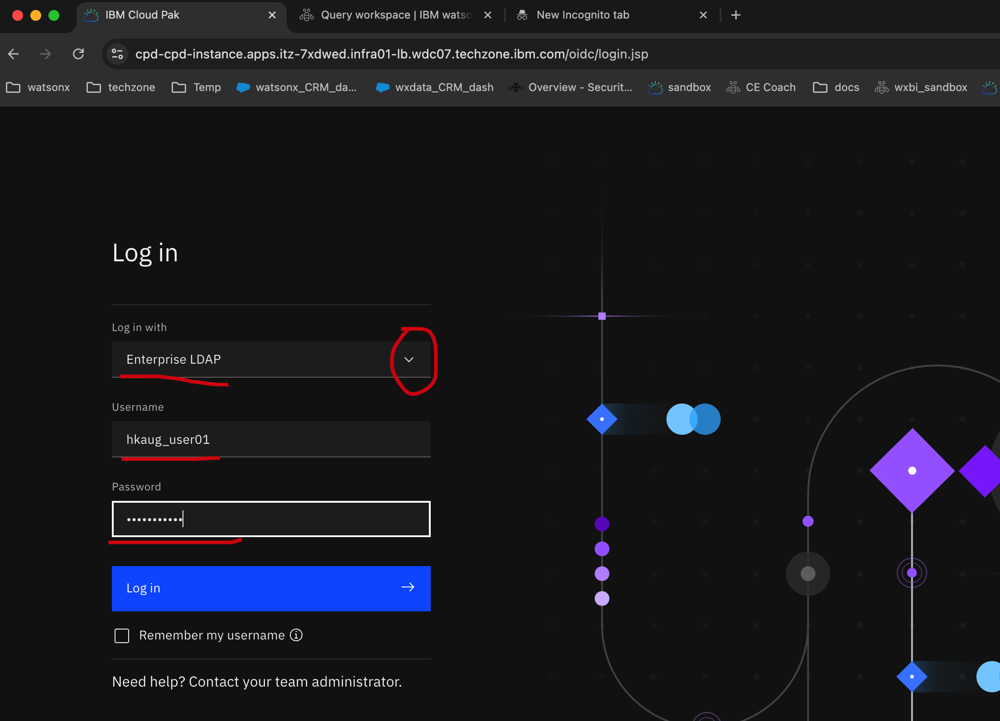

If everthing is fine, you should see the login page as below

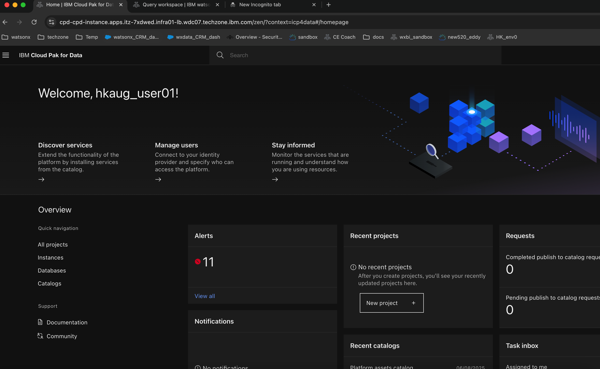

    

###  Step 2: Check your access to IBM CP4D

In the CP4D platform, go to the upper right cornor and click the "9 dots".

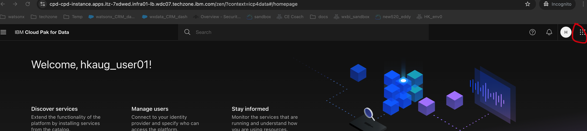

  
And select "IBM Cloud Pak for Data".

  
Then go to the upper left cornor and click the "Hamburger".
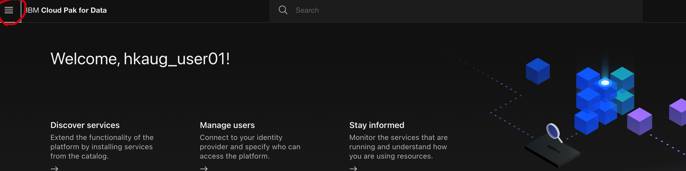

  
and click "Instances" under "Services".
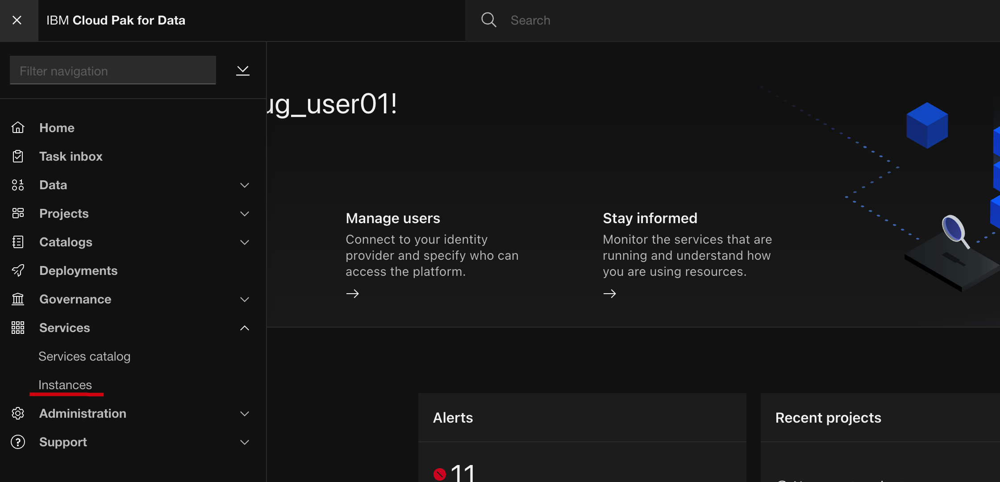

  
In the new open "Service instances" page, hover your mouse to the lakehouse and open it.

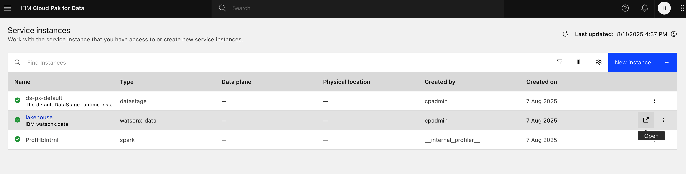

  
Then you can see another page had been opened. Go to the left side bar, click the "Infrastructure Manager" and you could have a glance of the watsonx.data

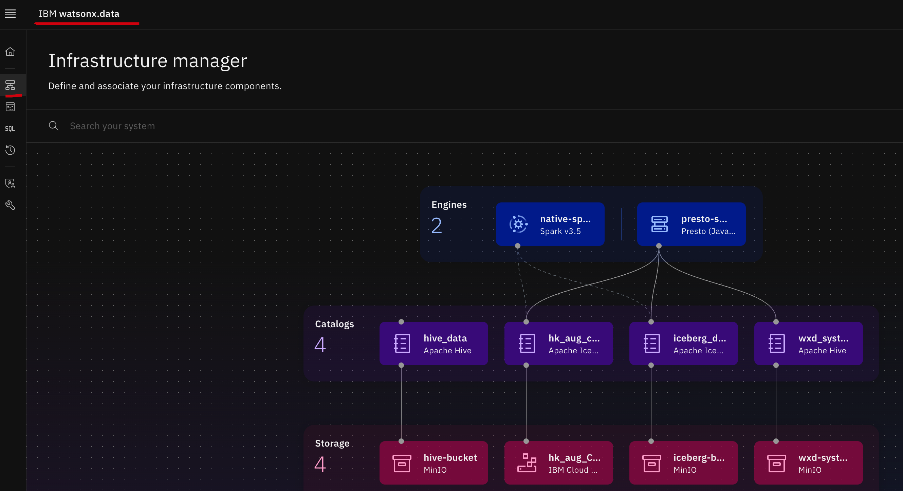

    

###  Step 3: Warmed up: Load a .csv file and test the query with Presto

Go to the left side bar, click the "Data Manager" and then click the "Ingest Data" on the right upper corner
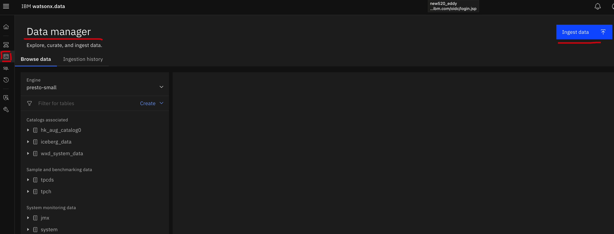

  
Select "Local System"
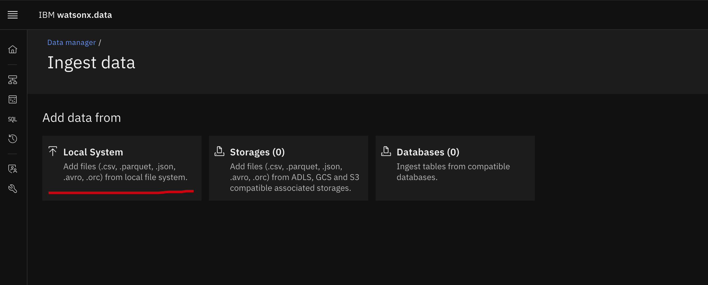

  
In the right upper cornor, select "Iceberg_data", and drag the csv into the box
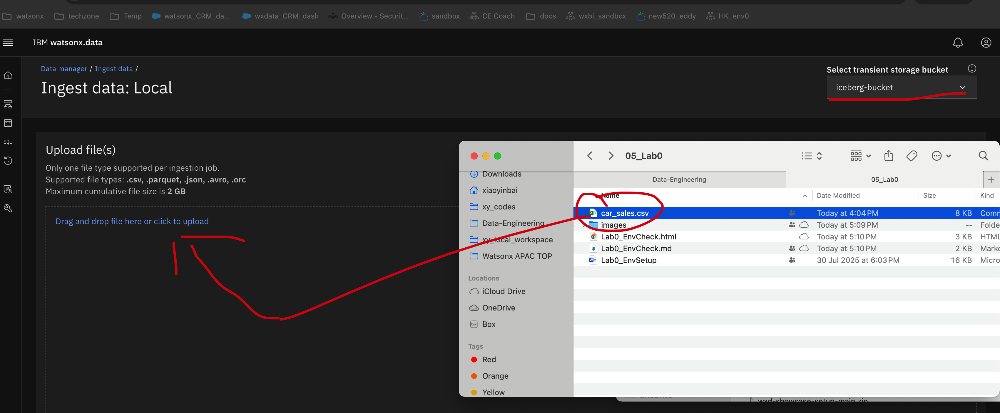

  
Click "Next"
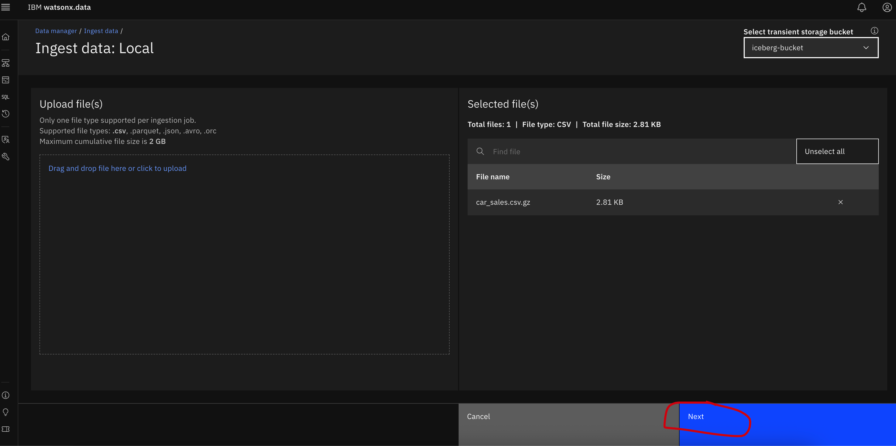

  
Select "iceberg_data" as catalog, "test" as schema==>Create a new table with name [your_test_table_name, like xiaoyin]-test==> click "Preview"
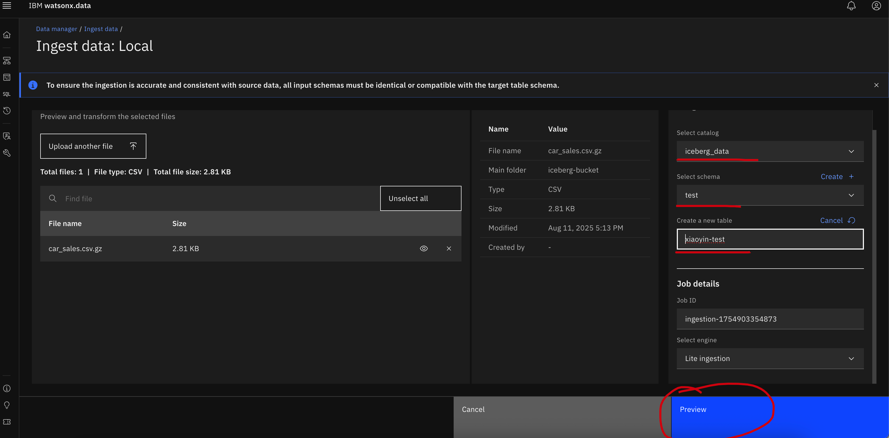

  
You will see the data sample, click "Ingest"
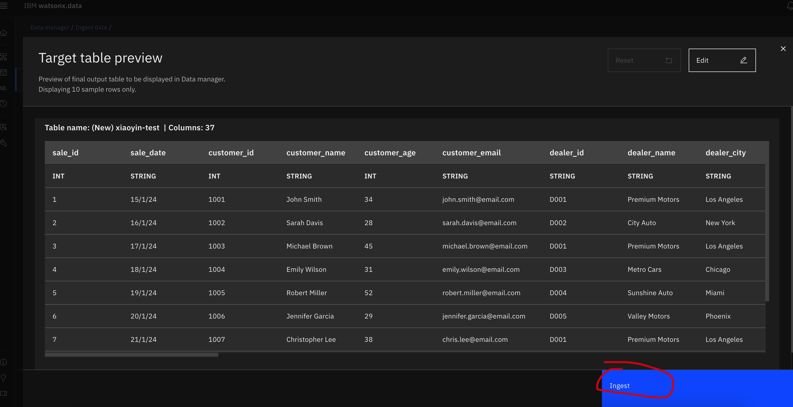

  
You will see an "Finished" Ingestion Job
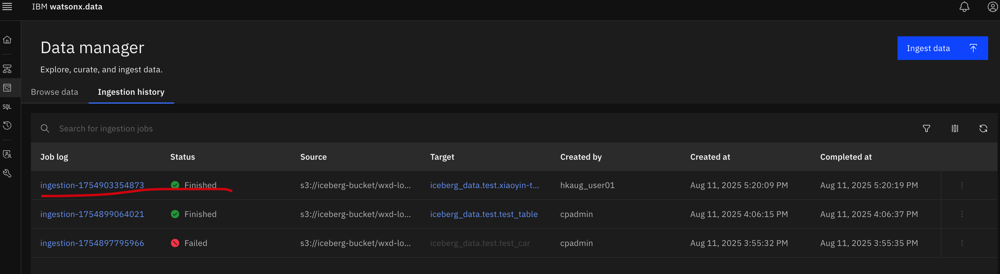

  
Go to life side bar==>Click "Query workspace"==>Go to iceberg_data->test->table you created==>click "</>"==> "Generate Select" ==> "Run on presto-small", you will see the sample data
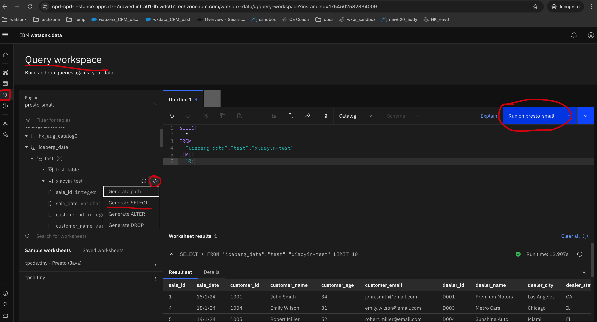

###  Step 4: Generate API keys for future labs

In the CP4D platform, go to the upper right cornor and click the user icon and then click "Profile and settings".

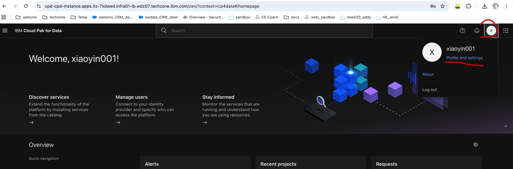

  
Then "API key" ==> "Generate new key".
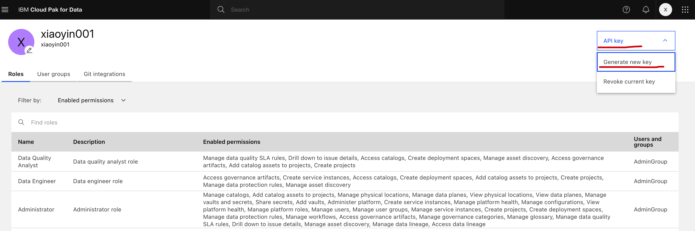

  
Click "Gnerate".
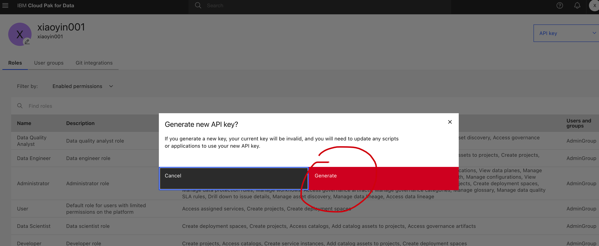

  
Copy and store your API key somewhere, you will need it later!
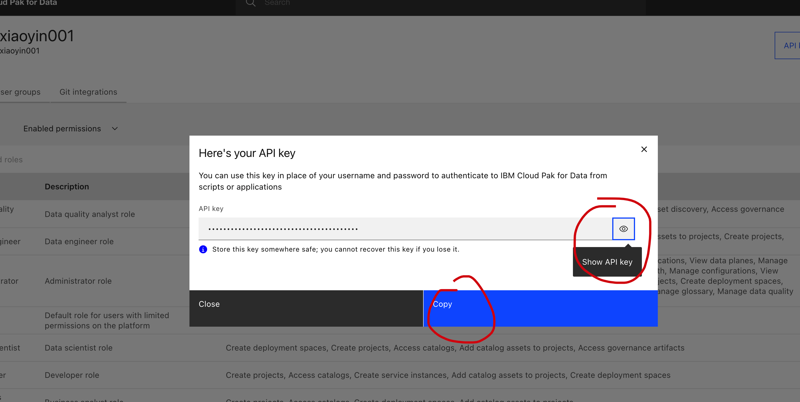