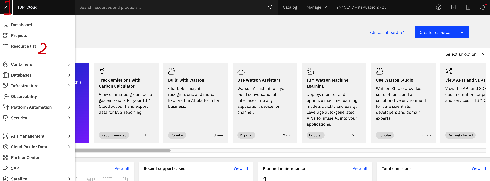
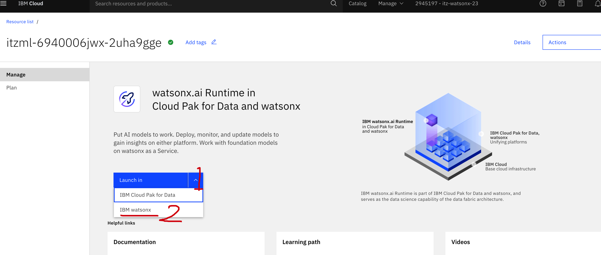
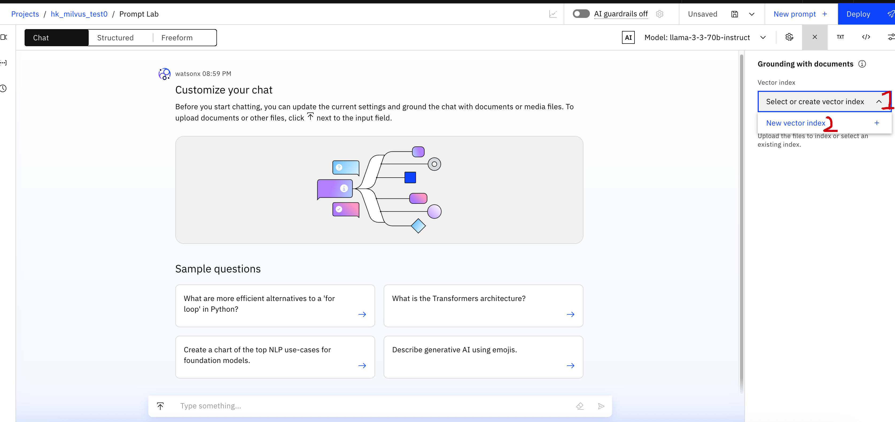
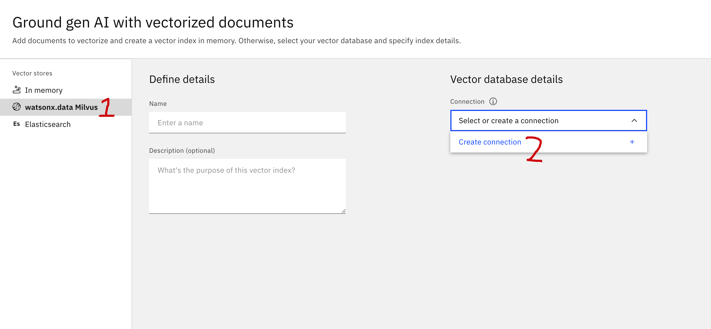
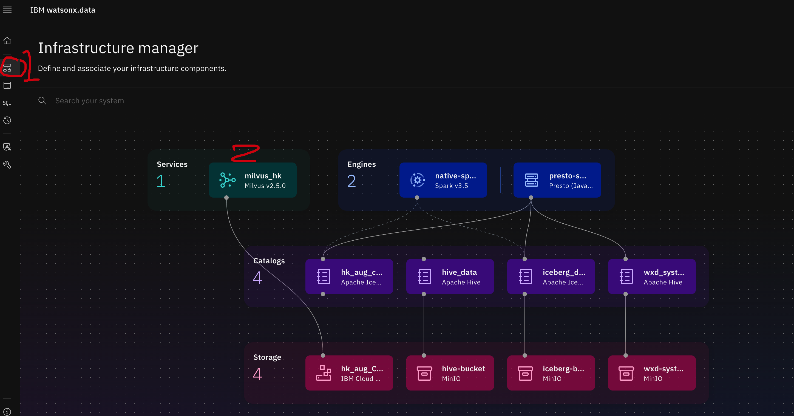
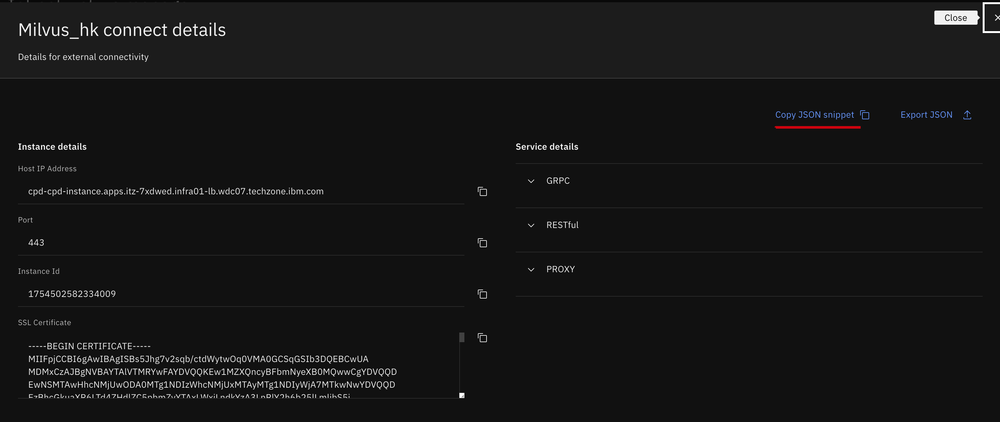
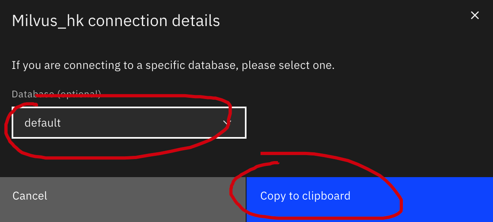
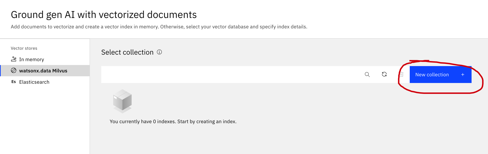
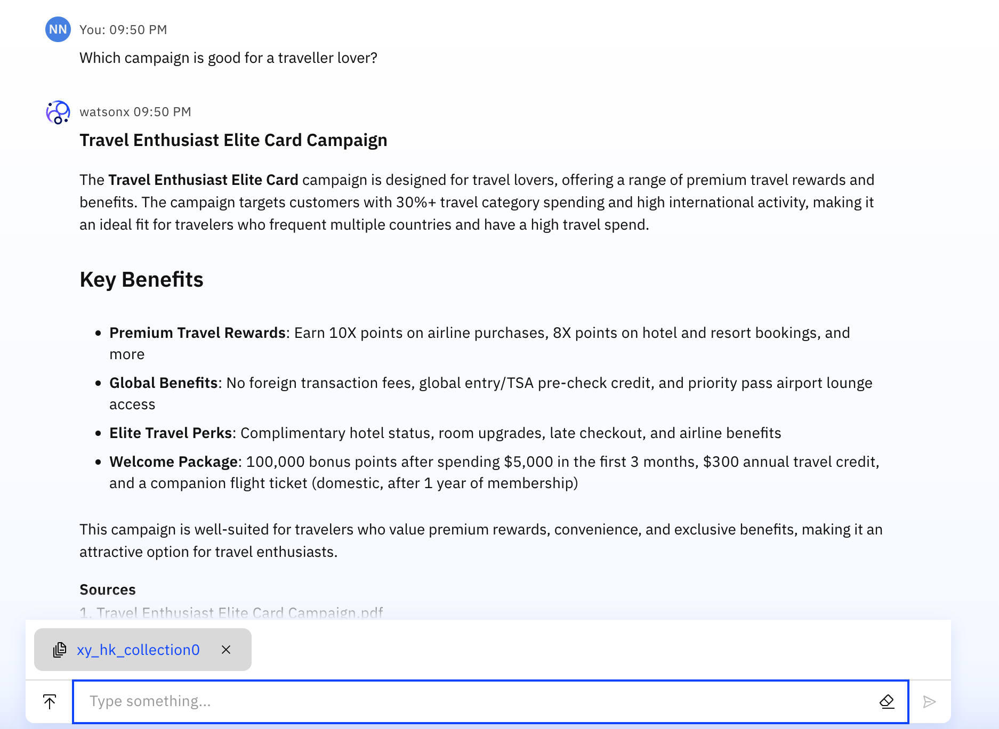

# Lab4: Data platform for GenAI 

## What would you expect in this lab 
Build your own Vector Database and working with IBM watsonx.AI
1.	Ingest PDFs into Milvus on watsonx.data.
2.	"Talk" to your PDFs (vectors in the Milvus)

## Detailed steps 
### Step 1: Set up your watsonx.AI 
 
 Log in the watsonx.AI (URL, username and password would be in another file)

  
 
 Click the left top corner's "Hamburger" and go to "Resource List"

  
 
Go to "AI/Machine Learning" and click the resource with Product of watsonx.Aai Runtime, please notice the Group as well

  
 
In the next page, go to "Launch in" pull down list and select "IBM watsonx"

  
 
In the watsonx.AI, similar as for CP4D, go to left upper corner "Hamburger"-->"View all projects"-->"New project"

  
 
Give a project name and create it

  
 
Associate the watsonx.AI service: In the project, go to "Manager" --> Associate Service

  
 
Check the only service you could see and click "Associate"

  
 
Go to prompt lab

  
 
Then start to test the chat function  
You can change the LLM if you want

### Step 2: Build Milvus Connection 
 
In the chatting UI, go to right upper corner and click "Grounding with Documents" (you might need to clear the chat)

  
 
New vector index

  
 
Select Milvus and create a new connection

  
 
!!Note, this step is at watsonx.data UI  
Go to "Infrastructure manager"-->Milvus  
View Connection Details  
Copy Json Snippet  
Select Database as default and "Copy to clipboard"  

  
 
!!Note, go back to watsonx.AI UI  
Enter Json Snippet  
Paste and Enter  
Enter username, password, test and create  

  
 
Give an index name  
Select database as default  
Select an embedding model  
Next  

  
 
New collection  
Give a collection name-->Select Chunk Size and Overlap size-->Upload PDFs-->Create  

  
 
Waiting until the index is ready  
Test "talking" with Milvus 

